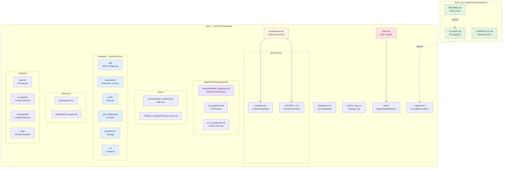

# CI/CD Playbook

**Location:** `docs/playbooks/organizational/ci_cd_playbook.md`

This playbook defines continuous integration and deployment conventions, enforcement hooks, and automated validation requirements. It is referenced by the [Master Documentation Playbook](documentation_playbook.md) and works in conjunction with the [PR Playbook](pr_playbook.md).

## 1) CI Pipeline Overview

### 1.1 Purpose

The CI pipeline ensures:
- Code quality and consistency
- Test coverage and passing tests
- Documentation standards compliance
- Build success across supported platforms
- Security best practices

### 1.2 When CI Runs

CI checks execute on:
- Every push to a pull request branch
- Pull request creation or update
- Push to main branch (post-merge validation)
- Scheduled nightly builds (optional)

## 2) Required CI Checks

All repositories MUST implement these checks:

### 2.1 Code Quality

**Linting**
- Language-specific linters (ESLint, rustfmt, etc.)
- Must pass with zero warnings (use `--max-warnings=0` for ESLint)
- Configuration files in repository root (`.eslintrc.json`, `.rustfmt.toml`, etc.)

**Code Formatting**
- Automated formatters (Prettier, rustfmt)
- Enforce consistent code style
- Consider auto-fix on pre-commit hooks

**Type Checking**
- TypeScript: `tsc --noEmit` with strict mode
- Rust: `cargo check` and `cargo clippy`
- Must pass without errors

### 2.2 Build Validation

**Compilation**
- Project must build successfully
- TypeScript: `npm run build` or `tsc`
- Rust: `cargo build`
- Fail CI if build errors occur

**Dependency Check**
- Verify lockfiles are up to date
- Check for known security vulnerabilities
- Consider using `npm audit`, `cargo audit`

### 2.3 Test Suites

**Unit Tests**
- Must pass with 100% success rate
- No skipped tests without justification
- Vitest, Jest, cargo test, etc.

**Integration Tests**
- If present, must pass
- May run selectively on affected modules

**Coverage Requirements** (optional per repo)
- Track test coverage metrics
- Consider failing if coverage drops below threshold
- Report coverage in PR comments

### 2.4 Documentation Validation

**Metadata Header Validation** (REQUIRED)
- All markdown files under `/docs` MUST have required metadata headers
- Validate schema: `doc_type`, `subsystem`, `version`, `status`, `owners`, `last_reviewed`
- Reject PR if any doc is missing required fields

**Placement Validation** (REQUIRED)
- No markdown files added outside `/docs` (except approved exceptions)
- Approved exceptions: `README.md`, `CHANGELOG.md`, `.vscode/*`, crate `README.md` files
- Reject PR if unapproved docs found outside `/docs`

**Link Validation** (RECOMMENDED)
- Check internal markdown links resolve
- Warn on broken links (may not be hard-fail initially)
- Tool: `scripts/validate_links.py` or similar

**Mermaid Diagram Syntax** (REQUIRED if diagrams present)
- Validate Mermaid code blocks compile
- Catch syntax errors before merge
- Tool: `mermaid-cli` or similar

**Domain Naming Validation** (REQUIRED)
- Files under `docs/domains/<domain>/` MUST include declared domain code prefix
- Tool: `scripts/validate_domain_docs_naming.py`
- Reject PR if validation fails

**Task Tracking Heuristic** (RECOMMENDED)
- If files added under `docs/tasks/`, check if `docs/todo.md` was updated
- Warning only (not hard-fail)
- Helps maintain task tracking discipline

### 2.5 Security Checks

**Dependency Scanning**
- Scan for known CVEs in dependencies
- Fail on high-severity vulnerabilities
- Tools: `npm audit`, `cargo audit`, Snyk, etc.

**Secret Scanning** (RECOMMENDED)
- Prevent accidental secret commits
- Check for API keys, passwords, tokens
- Tools: `git-secrets`, `trufflehog`, GitHub Advanced Security

**SAST (Static Analysis)** (OPTIONAL)
- Static application security testing
- Language-specific security linters
- Tools: Semgrep, CodeQL

## 3) Pre-Push Hooks

### 3.1 Purpose

Pre-push hooks catch issues locally before CI runs, providing faster feedback.

### 3.2 Required Hooks

**Domain Naming Validation**
- MUST run `scripts/validate_domain_docs_naming.py` (or equivalent)
- Validates domain code prefixes in `docs/domains/` files
- Rejects push if validation fails
- Implementation: See §6.1.1 of Master Documentation Playbook

**Metadata Header Check** (RECOMMENDED)
- Validate docs have required frontmatter
- Faster than waiting for CI

### 3.3 Hook Installation

Use husky or similar for Git hook management:

```bash
npm install --save-dev husky
npx husky install
npx husky add .husky/pre-push "npm run validate:docs"
```

Ensure validation scripts are executable and reliable.

## 4) File Watcher Implementation

### 4.1 Purpose

Track documentation changes for audit and maintenance.

### 4.2 Requirements

**Revision Log** (`docs/revision_log.csv`)
- Monitor `**/*.md` changes
- Append CSV entries with format: `timestamp, actor, path, action, summary`
- Update on significant documentation changes

**Implementation Options**
- Git hooks (pre-commit, post-commit)
- CI workflow that updates log and commits back
- Manual update with validation in CI

**CSV Format**
```csv
timestamp,actor,path,action,summary
2025-11-10T12:00:00Z,username,docs/architecture.md,updated,Added section on WebSocket architecture
```

### 4.3 Validation

CI SHOULD verify:
- Revision log exists and is valid CSV
- Recent doc changes have corresponding log entries (heuristic)

## 5) CI Workflow Structure

### 5.1 Standard Workflow Stages

```yaml
name: CI

on:
  pull_request:
  push:
    branches: [main]

jobs:
  lint:
    runs-on: ubuntu-latest
    steps:
      - uses: actions/checkout@v4
      - name: Setup Node.js
        uses: actions/setup-node@v4
      - name: Install dependencies
        run: npm install
      - name: Lint
        run: npm run lint

  typecheck:
    runs-on: ubuntu-latest
    steps:
      - uses: actions/checkout@v4
      - name: Setup Node.js
        uses: actions/setup-node@v4
      - name: Install dependencies
        run: npm install
      - name: Type check
        run: npm run typecheck

  test:
    runs-on: ubuntu-latest
    steps:
      - uses: actions/checkout@v4
      - name: Setup Node.js
        uses: actions/setup-node@v4
      - name: Install dependencies
        run: npm install
      - name: Run tests
        run: npm test

  docs-validation:
    runs-on: ubuntu-latest
    steps:
      - uses: actions/checkout@v4
      - name: Validate metadata headers
        run: python scripts/validate_metadata_headers.py
      - name: Validate domain naming
        run: python scripts/validate_domain_docs_naming.py
      - name: Validate links
        run: python scripts/validate_links.py
```

### 5.2 Required Status Checks

Configure branch protection to require:
- All lint jobs pass
- All typecheck jobs pass
- All test jobs pass
- All docs validation jobs pass

## 6) Repository Structure Visualization

### 6.1 Requirement

Per Master Documentation Playbook §6.2, this playbook MUST include two repository documentation structure visualizations:
1. Text-first outline version
2. Mermaid diagram version with legend/labels

### 6.2 Text-First Documentation Structure

```
Jules Control Room Backend - Documentation Structure

docs/
├── architecture.md              # High-level system overview
├── architecture/
│   ├── roadmap.md              # Project roadmap and status
│   └── adr-0001-*.md           # Architecture Decision Records
├── standards.md                 # Documentation standards & metadata schema
├── agents.md                    # AI assistant guidance (mirrors CLAUDE.md)
├── todo.md                      # Single source of truth for tasks
├── revision_log.csv            # Documentation change log
│
├── playbooks/
│   └── organizational/
│       ├── documentation_playbook.md  # Master documentation governance
│       ├── pr_playbook.md             # PR process and requirements
│       └── ci_cd_playbook.md          # CI/CD conventions (this file)
│
├── plans/
│   ├── documentation-refactoring-plan.md
│   └── ATOMIC_INTEGRATION_PLAN.md
│
├── domains/                     # Technical documentation by domain
│   ├── api/                    # REST API documentation
│   ├── websocket/              # WebSocket documentation
│   ├── auth/                   # Authentication documentation
│   ├── jules-integration/      # Jules AI client documentation
│   ├── persistence/            # SQLite and webhook documentation
│   └── ui/                     # UI integration documentation
│
├── reference/                   # Reference documentation
│   ├── deployment.md
│   └── development-guide.md
│
├── research/                    # Research and analysis
│   ├── gemini/                 # Gemini-generated analysis
│   ├── pr-reports/             # Ephemeral PR reports (14-day retention)
│   ├── checkpoints/            # Validation packs (limited retention)
│   └── logs/                   # Investigation logs (30-day retention)
│
└── tasks/                       # Supporting task materials

Root-level approved exceptions:
├── README.md                    # Repository entry point
├── CLAUDE.md                   # AI assistant guidance (mirrors agents.md)
└── CHANGELOG.md                # Release notes
```

### 6.3 Mermaid Diagram Documentation Structure



**Legend:**
- 🟢 Green: Root-level approved exceptions (mirrors)
- 🟡 Yellow: Architecture and roadmap
- 🟣 Purple: Organizational playbooks
- 🔴 Red: Task tracking
- 🔵 Blue: Domain-specific technical documentation
- ➡️ Solid arrows: Direct dependencies
- ⇢ Dashed lines: Mirrored content

## 7) Self-Hosted Runners (Optional)

### 7.1 When to Use

Consider self-hosted runners for:
- Resource-intensive builds
- Access to specific hardware/environment
- Faster feedback (no queue wait)
- Cost optimization (heavy CI usage)

### 7.2 Setup

See `docs/playbooks/organizational/runner_setup.md` (if exists) for:
- Runner installation and configuration
- Security best practices
- Health check requirements
- Maintenance procedures

## 8) Deployment Automation

### 8.1 Continuous Deployment (Optional)

For projects with automated deployment:
- Deploy staging on merge to main
- Deploy production on release tag
- Include smoke tests post-deployment
- Rollback mechanism on failure

### 8.2 Release Process

**Automated:**
- Tag creation triggers release workflow
- Build artifacts
- Update CHANGELOG.md (or validate it's updated)
- Create GitHub release with notes

**Manual oversight:**
- Production deployments may require manual approval
- Critical systems should have deployment windows

## 9) Monitoring and Alerts

### 9.1 CI Health Monitoring

Track metrics:
- Build success rate
- Average build duration
- Flaky test detection
- Queue times

### 9.2 Alerting

Set up notifications for:
- CI failures on main branch
- Security vulnerability detection
- Excessive build times
- Failing scheduled builds

## 10) Best Practices

### 10.1 Fast Feedback

- Run fastest checks first (lint before tests)
- Parallelize independent jobs
- Cache dependencies (`actions/cache`)
- Use appropriate runner sizes

### 10.2 Reproducibility

- Pin action versions (`@v4` not `@latest`)
- Lock dependencies
- Document environment requirements
- Provide local reproduction steps

### 10.3 Security

- Use secrets management for credentials
- Minimize runner permissions
- Review third-party actions before use
- Keep runner images updated

### 10.4 Maintenance

- Regularly update dependencies
- Remove obsolete workflows
- Monitor runner disk space
- Archive old build artifacts

## 11) Related Documentation

- [Master Documentation Playbook](documentation_playbook.md) - Overall documentation governance
- [PR Playbook](pr_playbook.md) - Pull request requirements
- [Documentation Standards](../../standards.md) - Metadata schema and changelog rubric
- [Development Guide](../../development-guide.md) - Local development setup

## 12) Exceptions and Overrides

Repository-specific exceptions to this playbook must be documented in that repository's `docs/standards.md` under "Approved Exceptions" and link back to this playbook.

## Appendix A - Validation Script Requirements

### validate_metadata_headers.py

Must validate:
- All markdown under `/docs` has YAML frontmatter
- Required fields present: `doc_type`, `subsystem`, `version`, `status`, `owners`, `last_reviewed`
- Field values match allowed enums (per Master Playbook §3)
- Date format is YYYY-MM-DD
- Version follows semver

### validate_domain_docs_naming.py

Must validate:
- Each domain folder has a `domain_code` declaration in overview frontmatter
- All files under `docs/domains/<domain>/` include the domain code prefix
- Allow redirect stubs during migration (check for `redirect:` in frontmatter)
- Fail if domain code missing or file doesn't follow naming convention

### validate_links.py

Should validate:
- Internal markdown links resolve to existing files
- No broken anchor links
- Warn on external links (optional: check if accessible)
- Report broken links with file and line number

## Appendix B - Example GitHub Actions Workflow

See the Standard Workflow Structure in §5.1 above for a complete example.

Additional considerations:
- Use matrix strategy for multi-platform builds
- Separate jobs for different validation types
- Store test results as artifacts
- Comment PR with coverage reports
